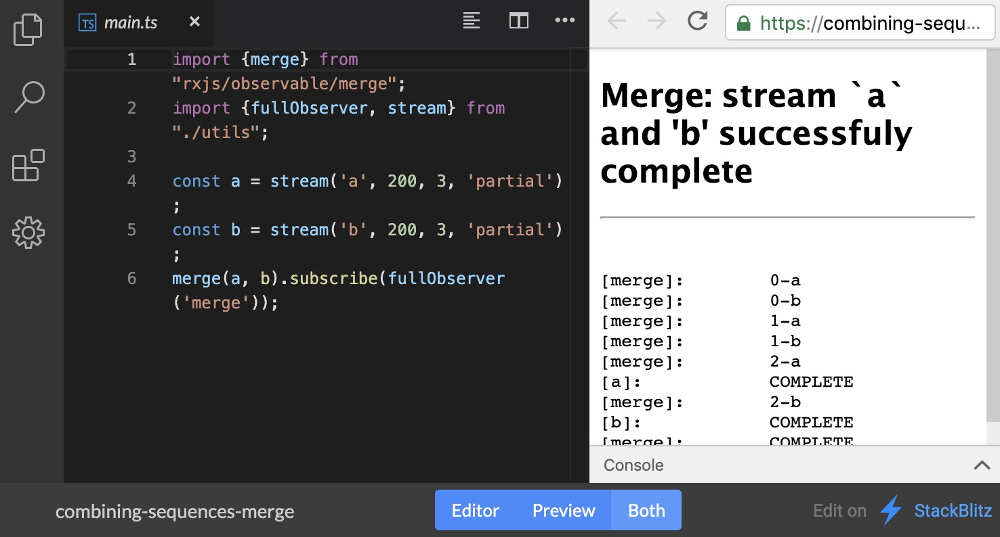
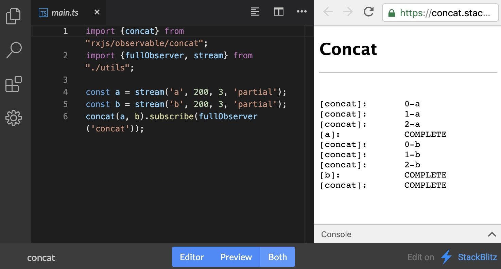
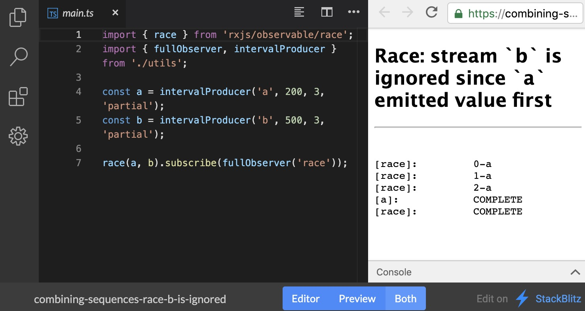
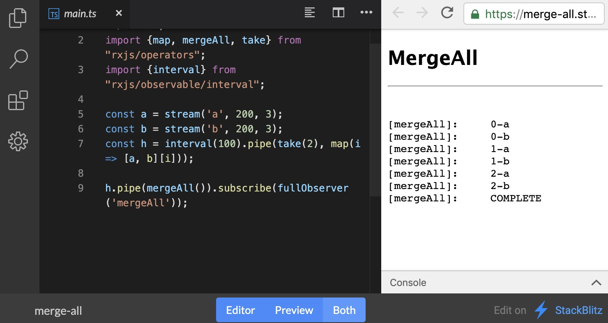

### 原文地址
[Learn to combine RxJs sequences with super intuitive interactive diagrams](https://indepth.dev/learn-to-combine-rxjs-sequences-with-super-intuitive-interactive-diagrams/)

### 译文内容


在本文中，您将找到最流行的RxJS组合运算符（如mergeMap、forkJoin等）的动态可视化解释。本文还描述了每一种运算符的具体使用方式和终止条件.

当你面对足够复杂的应用程序时,你通常需要面对来自多处数据源的数据. 它可以是多个像Firebase 类的外部数据点,也可以是用户正在使用的几个UI组件.

通过组合序列技术，你可以将来自不同数据流的数据融合成一次进而完成复杂查询。RxJs提供了非常多的运算符来帮你完成上面提到的事情，在这篇文章里我们来看一下最常用的一些。

为了制作动图直观的展示不同操作符处理数据流的方式，我都快成了兼职动画专家了。不过，这些动图都是作为GIF动画嵌入的，加载需要一点时间，请耐心一点等待。

在随附的代码中，我将使用可操作的运算符，所以如果你对他们不熟悉的话可以参考这里（把它称为“管道运算符”）。我将使用自定义流运算符，改运算符会在被订阅时同步交付的第一项数据后保持异步数据发送。

以下是我会在文章中持续使用的图表的图例：


##### 同时合并多个序列

首先我们来看以下merge操作符。这个操作符会结合来自不同输入流的若干数据，并将这些所有的数据同时发出。只要有数据从被结合的输入流中产生，这些数据就会出现在最终的结果序列里。这个过程在文档中通常被称为扁平化。

只有所有的输入流都发送数据完成，由merge操作符结合的数据流序列才算完成。只要其中任何一个数据流出错或者没有完成，merge操作就不会完成。

如果你不关心不同数据的产生顺序，只想知道来自不同数据源的全部数据有哪些，那你就可以使用这个操作符，就像他们是来自于同一个数据流一样。

下图展示了merge操作对来自于A和B两个数据流的数据的合并。A和B每个数据流都发出3条数据，他们一经产生就会被合并到结果序列中。


这是上面所展示动图的代码示例:

```
const a = stream('a', 200, 3, 'partial');
const b = stream('b', 200, 3, 'partial');
merge(a, b).subscribe(fullObserver('merge'));
// can also be used as an instance operator
a.pipe(merge(b)).subscribe(fullObserver('merge'));
```

和stackblitz可编辑的[演示](https://stackblitz.com/edit/combining-sequences-merge)：



##### 顺序连接多个序列

下一个组合的方法是concat。它连接所有订阅的流，并依次发出每个流的数据，每次只有一个有效的订阅。一旦当前的流发送数据完成，那就转到下一个数据流，把它传递过来的数据转化为结果序列。

当所有的输入流结束的时候，合并流才完成，如果有输入流报错，合并流就会抛出一个错误。如果某些输入流没有完成，那么合并流也不会完成，因为这意味着有些输入流永远也不会被订阅。

如果数据发出的顺序对你来说是重要的，你想先看到你加入的第一个输入流的数据，那么你就可以使用这个运算符。比如说，你可能有来自缓存和远程服务器的两个来源的数据序列。使用concat连接他们，这样来自缓存中的数据就会被先传递出。

下图中展示了用concat连接来两个不同数据流A和B的数据的过程，每个数据流产生3条数据，可以看到，这些数据先从A然后到B依次进入结果序列中。


这是上面所展示动图的代码示例:

```
const a = stream('a', 200, 3, 'partial');
const b = stream('b', 200, 3, 'partial');
concat(a, b).subscribe(fullObserver('concat'));
// can also be used as an instance operator
a.pipe(concat(b)).subscribe(fullObserver('concat'));
```

和stackblitz可编辑的[演示](https://stackblitz.com/edit/concat)：



##### 竞争性序列合并

下一个操作符race介绍了一个很有趣的概念，它不合并每个数据序列，而是用来选择第一个产生数据的可订阅序列。当一个序列开始产生数据的时候，其他的序列就被取消订阅，并且被忽略了。race序列的结果跟随被选中的序列的变化而变化，不论是完成或出错，如果选中序列没有完成，那么race序列永远也不会完成。

当你有多个数据源可以选择的时候，这个操作符就非常有用。比如说，分布在世界各地的服务器由于网络问题，造成的延迟不可预测，而且变化很大。使用这个运算符，你可以把同一个请求发送个多个数据源，然后消费第一个数据源返回的数据。

下图中展示了用race连接来两个不同数据流A和B的数据的过程，每个数据流产生3条数据，从图中可以看到，只有来自A的数据被发出了，因为它是第一个发出数据的流。


这是上面所展示动图的代码示例:

```
const a = intervalProducer('a', 200, 3, 'partial');
const b = intervalProducer('b', 500, 3, 'partial');
race(a, b).subscribe(fullObserver('race'));
// can also be used as an instance operator
a.pipe(race(b)).subscribe(fullObserver('race'));
```

和stackblitz可编辑的[演示](https://stackblitz.com/edit/combining-sequences-race-b-is-ignored)：



##### 利用高阶的可观察对象将位置数量的序列连接起来

上面提到的操作符，不论是作为静态还是实例版本，都只能连接已知数量的输入流序列。但是如果你想连接事先不知道数量，只有在运行时才知道数量的序列该怎么办？实际上，这是在与异步代码打交道的过程中一个非常常见的场景。举例来说，一次网络请求可能导致许多次其他的网络请求，而其他请求的数量由原始的请求结果所决定。

RxJs提供了一种上述操作符的变种，变种的输入是由序列组成的序列，所以被称作高阶可观测对象，也被称为可观测的可观测对象。这些操作符要求从可观测对象出得到的结果是序列（依然是可观测对象），然后运用上面提到的规则处理得到的结果。

只要任何一个被包含的数据流出错，这些操作符就会出错，而且它们只能被作为实例使用。现在，让我们来一个一个地看一下这些操作符。

##### MergeAll

该操作符组合了所有内部发出的流，然后使用普通的merge操作同时每个数据流接收数据。

在下面的动图中你可以看到，高阶的H数据流产生了两个低阶数据流A和B。mergeAll操作符接收了来自两个数据流的数据，然后在他们出现时将它们传递到结果序列中。


这是上面所展示动图的代码示例:

```
const a = stream('a', 200, 3);
const b = stream('b', 200, 3);
const h = interval(100).pipe(take(2), map(i => [a, b][i]));
h.pipe(mergeAll()).subscribe(fullObserver('mergeAll'));
```

和stackblitz可编辑的[演示](https://stackblitz.com/edit/merge-all)：



##### concatAll

该操作符组合了所有内部发出的流，然后使用普通的concat 操作依次从每个数据流接收数据。

在下面的动图中你可以看到，高阶的H数据流产生了两个低阶数据流A和B。concatAll 操作符先接收来自A的数据，然后接收来自B的数据。然后将它们传递到结果序列中。


这是上面所展示动图的代码示例:

```
const a = stream('a', 200, 3);
const b = stream('b', 200, 3);
const h = interval(100).pipe(take(2), map(i => [a, b][i]));
h.pipe(concatAll()).subscribe(fullObserver('concatAll'));
```

和stackblitz可编辑的[演示](https://stackblitz.com/edit/concat-all)：


##### swithcAll

有时候，我们并不想从所有的内层可观测对象中获取数据。在一些场景中，我们之最最新的来自内部序列的值感兴趣。搜索就是一个很好的例子。当用户在搜索框中输入内容时，请求被发送到服务器，因为这是一个异步操作，所以返回值是一个可观测对象。用过用户在返回结果之前更新了搜索框里的内容怎么办呢？第二次请求被发出，所以现在已经有两次查询被发送到了服务器。但是，我们对第一次的搜索并不感兴趣。另外，如果第一次的搜索结果和第二次搜索结果合并在一起了，那么用户会非常惊讶。我们不希望这样，所以这时候就需要用到switchAll运算符。他只订阅并产生从内层数据流传出的最近的值，而忽略其他的数据流。

在下面的动图中你可以看到，高阶的H数据流产生了两个低阶数据流A和B。switchAll操作符先从A中获取数据，一旦B出现，操作符又转向B获取数据，从而放弃A剩下的数据。


这是上面所展示动图的代码示例:

```
const a = stream('a', 200, 3);
const b = stream('b', 200, 3);
const h = interval(100).pipe(take(2), map(i => [a, b][i]));
h.pipe(switchAll()).subscribe(fullObserver('switchAll'));
```

和stackblitz可编辑的[演示](https://stackblitz.com/edit/switch-all)：


##### concatMap, mergeMap 和 switchMap

有意思的是，在操作可观测的可观测对象上，concatMap、mergeMap 和switchMap 比concatAll、mergeAll 和switchAll 更常用。但是，如果你仔细考虑一下，它们其实是差不多的东西。所有的Map 类操作符包含两个部分的内容，通过映射和对由高阶数据流产生的内部数据流应用组合逻辑来产生最终的结果数据流。

让我们来看一段熟悉的代码，它描述了mergeAll 是如何工作的：

```
const a = stream('a', 200, 3);
const b = stream('b', 200, 3);
const h = interval(100).pipe(take(2), map(i => [a, b][i]));
h.pipe(mergeAll()).subscribe(fullObserver('mergeAll'));
```

这里面map 提供了一个可观测的数据流，mergeAll 结合了所有来自数据流的对象。而我们使用mergeMap 操作符就可以实现这两个功能：

```
const a = stream('a', 200, 3);
const b = stream('b', 200, 3);
const h = interval(100).pipe(take(2), mergeMap(i => [a, b][i]));

h.subscribe(fullObserver('mergeMap'));
```

结果将会是完全一样，对于concatMap 和switchMap 也成立 —— 自己尝试一下吧。

##### 通过数据配对组合序列

